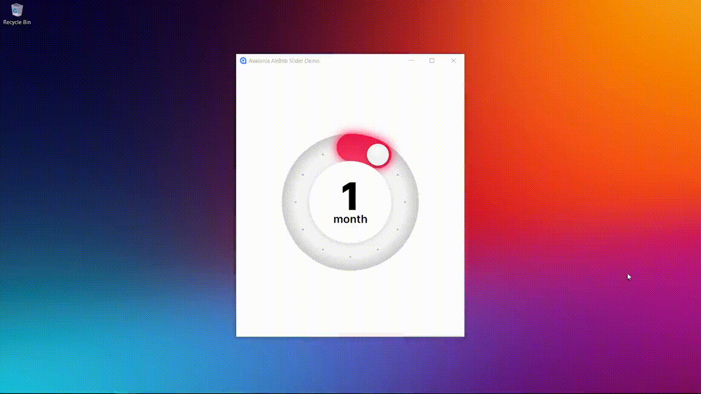

# Avalonia AirBnb Slider Demo

A small demo app that is a recreation of the custom AirBnb slider control built with Avalonia. The custom circular/slider UI components (located in `AvaloniaAirbnbSlider/Views/Components`).

## Preview

## In Action

https://github.com/russkyc/avalonia-airbnb-slider-demo/blob/master/.github/images/demo-video.mp4

## License

This is licensed under the MIT License. See the LICENSE file for details.